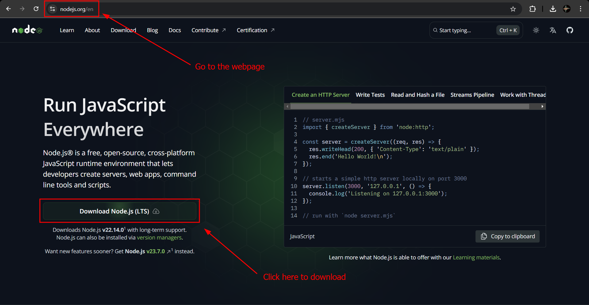
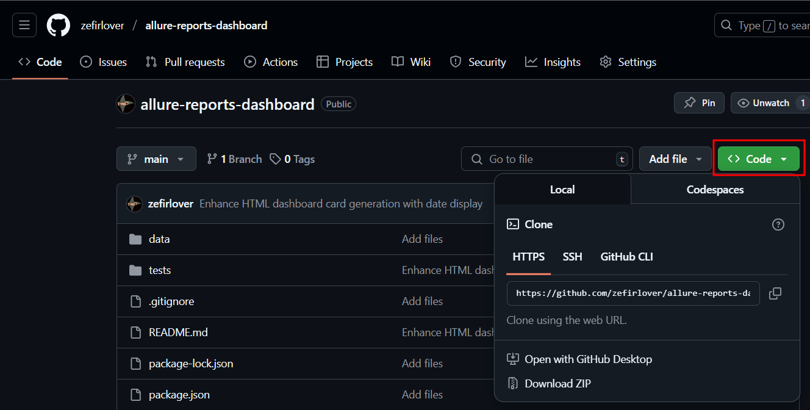
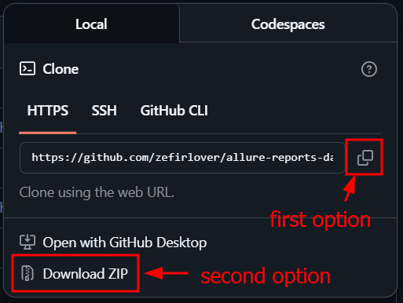

# allure-reports-dashboard

This silli little project was created to display all Allure Reports results you need on one HTML page called the Dashboard

## To-do list

- [x] Add Getting started
- [ ] Add Run project locally
- [ ] Add Workflow description

## Getting started

This project is using:

- [Node.js](https://nodejs.org/en)
- [Playwright] (https://playwright.dev/)

To use the project a [Node.js](https://nodejs.org/en) needs to be installed first:

After downloading the **Node.js installer** open it and follow instructions on a screen. After that you can download the project.

The project can be downloaded using `git clone` command or manually using *an archive option* (Download ZIP). All that options are accessible via green **Code** button at *the project main page*:

To download the project using *cmd command* click on **Code** button and then **copy** button under `Clone` section *(1st option)*.

To download source code using *an archive option* go to the same menu, but click on **Download ZIP** option *(2nd option)*, and then unarchive the project anywhere you want:

